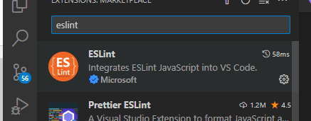
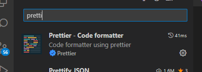
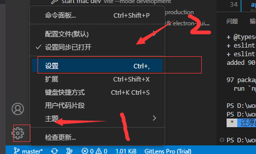
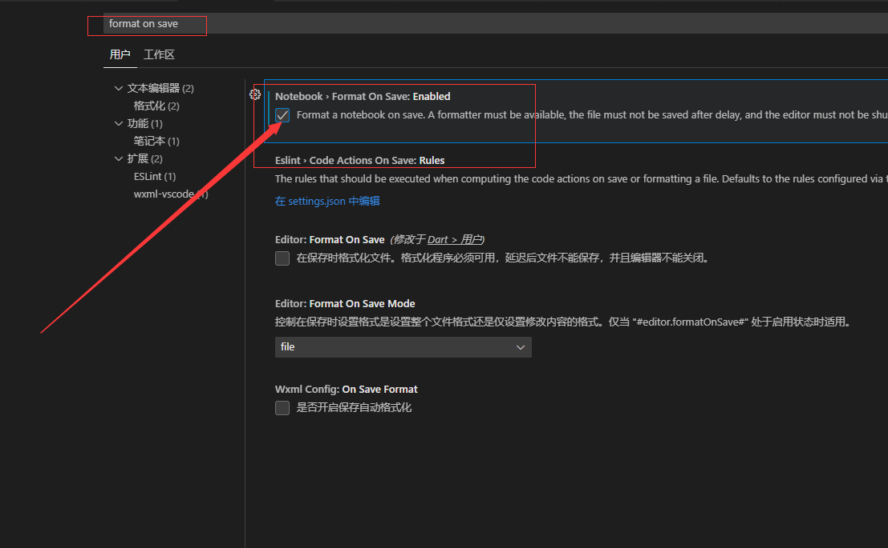
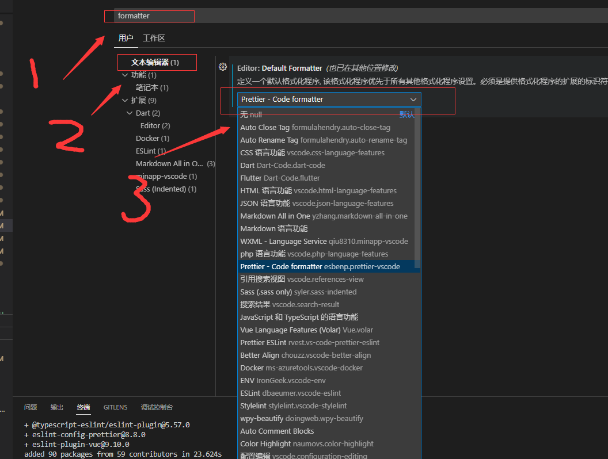

# 开始

1. 配置 npm 镜像

```cmd
# 指定 npm 国内镜像
npm config set registry=https://registry.npm.taobao.org/
# 指定 Electron 的国内镜像地址
npm config set electron_mirror=https://npm.taobao.org/mirrors/electron/
```

2. 安装依赖

```cmd
npm i
```

3. 如果依赖安装失败，使用cnpm装

```cmd
# 安装cnpm
npm install -g cnpm --registry=https://registry.npm.taobao.org 
# 使用cnpm安装依赖
cnpm i
```

# 必装插件

- eslint    语法检测
- prettier  代码格式化
- volar [安装两个]
  - 一个基础 vue 语法提示
  - 一个 ts 版语法提示

# 推荐插件
+ Element Plus Snippets [大量element代码块]
+ Vue VSCode Snippets   [大量vue代码块]


# 工程目录结构

```diff
+ ├─┬ electron
+ │ ├─┬ main
+ │ │ └── index.ts    Electron主进程入口
+ │ └─┬ preload
+ │   └── index.ts    预加载ts脚本
  ├─┬ src
  │ ├── main.ts       Electron-渲染进程入口[即vue相关页面构建代码]
  | ├── assets        静态资源目录
  | ├── components    封装的vue组件目录
  | ├── directive     自定义指令
  | ├── hooks         组合式函数封装
  | ├── locales       国际化，多语言支持
  | ├── store         全局状态管理
  | └── utils         ts工具类
  ├── index.html
  ├── package.json
  └── vite.config.ts
```
# 开发流程
## 分支管理
1. 开发成员自行从master上拉取代码创建自己的分支，命名为自己的名字推送到远程
2. 每日下班前一次合并代码推送到master

## 代码提交要求
1. 先执行prettier脚本，自动格式化项目的代码【统一代码风格】
```cmd
npm run prettieer
```
2. 提交代码前下拉下最新代码
+  合并流程： 先拉取最新master代码到本地，本地合并代码，解决完冲突后再推送master
3. 提交代码

## 语法检测【必看】

项目已集成 EsLint，运行项目前先执行 lint 脚本，确认自己写的代码没有问题后，再执行 prettier 脚本进行格式化，然后提交 diamante

### 安装插件

vscode 安装两个插件：

- eslint [语法检测]
- prettier [格式化代码]





### 配置保存自动格式化

- 打开设置面板  
  

- 配置保存自动格式化  
  

- 配置格式化选择的插件 


# 常用操作

## 速查手册

[vite 官方文档](https://cn.vitejs.dev/guide/)  
[vue3 官方文档](https://cn.vuejs.org/guide/components/props.html)  
[element-plus](https://element-plus.org/zh-CN/component/button.html)  
[vue-router](https://router.vuejs.org/zh/guide/)  
[sass 官方文档](https://www.sass.hk/docs/)  
[ts 菜鸟教程](https://www.runoob.com/typescript/ts-object.html)  
[electron 官方文档](https://www.electronjs.org/zh/docs/latest/api/app)  
[element-plus](https://element-plus.org/zh-CN/component/button.html)  
[pinia 官方文档](https://pinia.web3doc.top/introduction.html)

## 国际化
项目已集成i18n国际化，项目开发过程中由前端配置的菜单、按钮、报错等文本信息，推荐使用国际化配置，方便后续直接进行多语言替换  
**操作流程：**  

+ 1.在[locales/pacakge](./src/locales/pacakge)中补充字段以及对应描述
+ 2.在[langMap](./src/locales/langMap.ts)中添加key的映射
+ 3.代码中使用

```ts
// .vue文件的script脚本中使用 必须是setup的
import { useI18n } from 'vue-i18n';
const { t } = useI18n();

// .vue文件的template中使用
{{ $t('menus.home') }}

// 自定义的ts工具类中使用
import { LangMap } from '@/locales/langMap'
import i18n from '@/locales';
const { t } = i18n.global;
console.log(t(LangMap.validate_notNull));

```
可参考[formDemo](./src/components/demo/FormDemo.vue)


## 请求发送

使用 axios 进行请求发送，已封装 axios 到 utils/api.ts 中，直接调用即可使用案例：

```js
import api from '@/utils/api';

api.get('url?p1=xxx&p2=xxx').then(res => {
  console.log(res);
});

api.post('url', { p1: 'xxx', px: 'xxxx' }).then(res => {
  console.log(res);
});

// 或使用全局api对象进行请求
import { getCurrentInstance } from 'vue';
const { proxy }: any = getCurrentInstance();

proxy.$api.get('url').then((res: any) => {
  console.log(res);
});
```

## 页面跳转

页面使用 vue-router 进行路由管理，官方文档：https://router.vuejs.org/zh/guide/  
[快速配置](src\router\index.ts)  
[直接看 Index.vue 中的路由例子](src\components\demo\Index.vue)

```js
import { useRouter, useRoute } from 'vue-router';
const router = useRouter();
router.push({ path: `/user/${username}` }); // -> /user/eduardo
// 如果可能的话，使用 `name` 和 `params` 从自动 URL 编码中获益
router.push({ name: 'user', params: { username } }); // -> /user/eduardo
// `params` 不能与 `path` 一起使用
router.push({ path: '/user', params: { username } }); // -> /user
```

## css 样式书写

样式书写使用 sass，同时兼容 css 样式

- 具体使用可参考官网：[https://www.sass.hk/docs/](https://www.sass.hk/docs/)
- 快速使用，参考博客：[https://www.cnblogs.com/hu308830232/p/14929143.html](https://www.cnblogs.com/hu308830232/p/14929143.html)
- [直接看 Demo.vue 中的样式例子](src\components\demo\BaseDemo.vue)

```scss
// 定义变量
$fontColor: white;
$borderColor: black;
$imgDir: '../../assets/imgs';
$ptClass: '.party2';

// 嵌套样式
.myBox {
  width: 200px;
  height: 200px;
  border: 1px solid #ccc;
  // 拼接变量
  background: url('#{$imgDir}/test.jpeg');
  background-size: cover;

  .party {
    font-size: 15px;
    color: $fontColor;
    border: 4px solid $borderColor;
    border-radius: 15px;
    margin-top: 50px;
    display: block;
    width: 100px;
  }

  // 变量做类名
  .party2 {
    font-size: 40px;
    color: pink;
  }
}
```

## 缓存，状态管理的使用

全局状态管理使用 pinia

- 详细使用教程参考官网：https://pinia.web3doc.top
- 注册到 pinia 中的状态是整个应用共享的，可以做一些缓存操作，缓存用户登录状态等
- 使用案例可以参考：[src\store\conterStore.ts ](src\store\conterStore.ts)

缓存已基于 localStorage 进行了封装 [cacheUtils](src\utils\cacheUtils.ts),使用：

```js
import cache from '@/utils/cacheUtils';

cache.set('name', '隔壁老王');
cache.get('name');
```

## 使用 element 的图标

已配置按需引入，使用案例：  
所有图标直接看官网：[https://element-plus.org/zh-CN/component/icon.html#%E5%9B%BE%E6%A0%87%E9%9B%86%E5%90%88](https://element-plus.org/zh-CN/component/icon.html#%E5%9B%BE%E6%A0%87%E9%9B%86%E5%90%88)  
调整为 i-ep-xx 即可

```html
<el-icon size="25" color="red">
  <i-ep-edit />
</el-icon>
```
