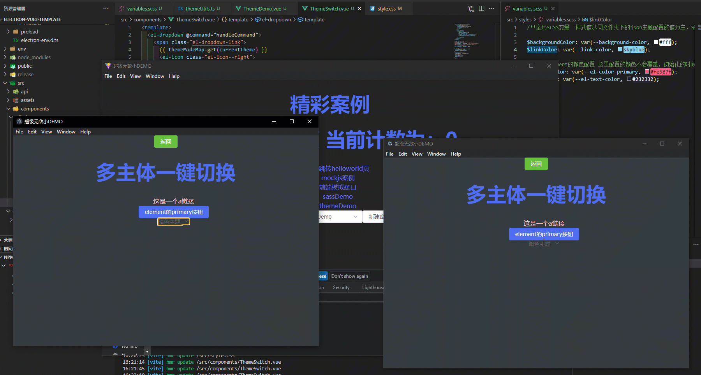

[](https://gitee.com/longzipeng/electron-vue3-template/stargazers) 
# 介绍
+ 本项目基于开源的electron构建脚手架：[electron-vite-vue](https://github.com/electron-vite/electron-vite-vue)搭建
+ 博客讲解：[electron+vue3全家桶专栏](https://blog.csdn.net/qq_42365534/category_12271233.html)  
+ 视频讲解：[electron+vue3全家桶视频讲解合集](https://space.bilibili.com/99214150/channel/collectiondetail?sid=1247775)


该工程已集成
所有使用案例均放在 [compoents/demo 目录](src\components\demo)下

# 技术栈

| 技术         | 描述                      | 学习地址                                                            |
| ------------ | ------------------------- | ------------------------------------------------------------------- |
| electron     | 写前端的方式开发桌面端    |  [官网](https://www.electronjs.org/zh/docs/latest/api/app)                                                                   |
| vite         | 新一代前端构建工具        | [官网](https://cn.vitejs.dev/guide/)                                |
| vue3         | 渐进式前端框架            | [官网](https://cn.vuejs.org/guide/components/props.html)            |
| typescript   | js 的超集，强类型语言 | [菜鸟教程](https://www.runoob.com/typescript/ts-object.html)        |
| element-plus | 前端 ui 框架              | [文档地址](https://element-plus.gitee.io/zh-CN/component/icon.html) |
| axios        | 请求发送                  | [官网](https://axios-http.com/zh/docs/intro)                        |
| pinia        | 全局状态管理              | [官网](https://pinia.web3doc.top/introduction.html)                 |
| Vue Router        | 路由管理              | [官网](https://router.vuejs.org/zh/guide/)                 |
| vue-i18n       | 国际化              | [官网](https://vue-i18n.intlify.dev/guide/)                 |
| sass     | Sass 是 CSS 的一种预编译语言，提供变量、嵌套规则等              | [官网](https://www.sasscss.com/guide)                 |
| mockjs       | 模拟数据                  | [官网](https://blog.csdn.net/qq_42365534/article/details/130059576) |

# 开始
1. 该项目开发使用的node环境为 16.19.0，建议node版本在其之上

2. 配置 npm 镜像

```cmd
# 指定 npm 国内镜像
npm config set registry=https://registry.npmmirror.com/
# 指定 Electron 的国内镜像地址
npm config set electron_mirror=https://npmmirror.com/mirrors/electron/
```

或者简单粗暴，直接改 C:\Users\[用户]\.npmrc

```.npmrc
registry=https://registry.npmmirror.com/
ELECTRON_MIRROR=https://npmmirror.com/mirrors/electron/
```

3. 安装依赖

```cmd
npm i
```

4. 快速删除 node_modules

```cmd
# 全局安装依赖
npm install rimraf -g
# 项目根目录执行
rimraf node_modules
```

# 工程目录结构

```diff
+ ├─┬ electron
+ │ ├─┬ main
+ │ │ └── index.ts    Electron主进程入口
+ │ └─┬ preload
+ │   └── index.ts    预加载ts脚本
  ├─┬ src
  │ ├── main.ts       Electron-渲染进程入口[即vue相关页面构建代码]
  | ├── assets        静态资源目录
  | ├── components    封装的vue组件目录
  | ├── directive     自定义指令
  | ├── hooks         组合式函数封装
  | ├── locales       国际化，多语言支持
  | ├── store         全局状态管理
  | └── utils         ts工具类
  ├── index.html
  ├── package.json
  └── vite.config.ts
```

# 必装插件

- eslint 语法检测
- prettier 代码格式化
- volar [安装两个]
  - 一个基础 vue 语法提示
  - 一个 ts 版语法提示

# 推荐插件
- Markdown All in One [预览 md 文件]
- Markdown Preview GitHub Styling [github 风格的 md 预览]

# 已集成实现功能
## i18n多语言+多窗口语言同步
+ [核心模块](src/locales)
+ [对应组件Language](src/components/Language.vue)


## mock模拟数据
[demo位置](src/components/demo/MockDemo.vue)


## 多主题切换+窗口主题同步
+ [核心模块](src/utils/themeUtils.ts)
+ [对应组件ThemeSwitch](src/components/ThemeSwitch.vue)



## pinia多窗口状态同步
+ 主动同步更新(推荐)
+ [核心插件实现](src/store/plugins/shareStoreByActionPlugin.ts)


+ 被动同步更新
+ [核心插件实现](src/store/plugins/shareStorePlugin.ts)


## 自定义窗口移动
[对应组件DragTool](src/components/DragTool.vue)


## 窗口事件广播


